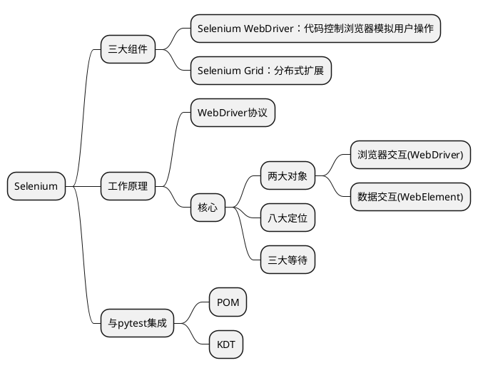

<!-- TOC -->
* [自动化测试](#自动化测试)
  * [WEB - Selenium](#web---selenium)
  * [概述](#概述)
    * [环境搭建](#环境搭建)
    * [工作原理](#工作原理)
    * [八大定位](#八大定位)
    * [等待](#等待)
      * [强制等待](#强制等待)
      * [隐式等待](#隐式等待)
      * [显式等待](#显式等待)
    * [与`pytest`集成](#与pytest集成)
      * [POM-页面对象模型](#pom-页面对象模型)
      * [KDT-关键字驱动模型](#kdt-关键字驱动模型)
      * [allure](#allure)
  * [APP - Appium](#app---appium)
<!-- TOC -->

# 自动化测试

## WEB - Selenium

## 概述



### 环境搭建

* `uv add selenium`
* `uv run helloworld.py`
  * 验证安装是否成功。注意`helloworld.py`是自己写的

### 工作原理

### 八大定位

```python
from selenium import webdriver
from selenium.webdriver.common.by import By

driver = webdriver.Chrome()
driver.get("https://www.bing.com")

driver.find_element(By.XPATH, '//*[@id="sb_form_q"]')
driver.find_element(By.CSS_SELECTOR, '#sb_form_q')
# 其他见By类
```

### 等待

#### 强制等待

```python
import time

time.sleep(1)  # 等待1s
```

#### 隐式等待

```python
from selenium import webdriver

driver: webdriver.Chrome = webdriver.Chrome()
driver.implicitly_wait(10)  # 设置隐式等待10s，浏览器启动后就会等待
```

#### 显式等待

```python
from selenium import webdriver
from selenium.webdriver.support.wait import WebDriverWait

driver = webdriver.Chrome()
wait = WebDriverWait(driver, 10)  # 指定等待超时时间10s
wait.until(lambda d: {
    # 这里写等待结束的逻辑 
    1 == 1
})
```

### 与`pytest`集成

* 安装插件 `uv add pytest-selenium`
* 编写测试用例。注意文件名以`test_`开头

```python
def test_login(selenium):  # 因为依赖了pytest-selenium，可以直接使用selenium
    selenium.get('https://portal-test.hd123.com/zl-portal-ui-test/login')
    assert 1 == 2
```

* 使用命令`pytest 登录 --driver chrome --html report.html `执行测试用例
  * 其中`登录`是文件夹名称，会自动执行这个文件夹下的所有用例。
    * 当然也可以指定具体单个用例执行
  * `--driver chrome`表示指定谷歌浏览器，
    * 可以换位其他的。比如火狐：firefox
  * `--html report.html`表示输出测试报告

#### POM-页面对象模型

* 全称：Page Object Model
* 核心思想
  * 页面作为一个类
  * 页面中的元素，作为类的属性
  * 页面中的方法，代表页面的操作

#### KDT-关键字驱动模型

* 全称：Keyword-Driven Testing
* 核心思想
  * 将数据与逻辑分离，把`selenium`操作抽象成关键字
  * 这样测试人员完全不需要关注代码，非开发人员也可以维护测试用例

#### allure

* allure 是目前主流的测试报告工具，支持步骤展示、用例分类、失败截图 / 日志、趋势分析，报告可交互性极强。
* 工程引入依赖：`uv add --dev allure-pytest`
* 执行用例并生成报告：`uv run pytest 登录 --driver chrome -v --alluredir=allure-results`
* allure
  * 安装：
    * macOS：`brew install allure`
  * 使用
    * 方式1: 执行`allure generate allure-results -o allure-report --clean`生成静态HTML报告
    * 方式2: 启动本地服务打开报告`allure serve allure-results`
      * 默认地址：[http://127.0.0.1:5252](http://127.0.0.1:5252)

## APP - Appium