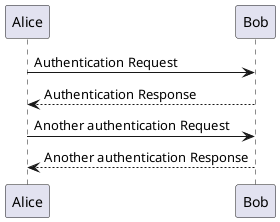
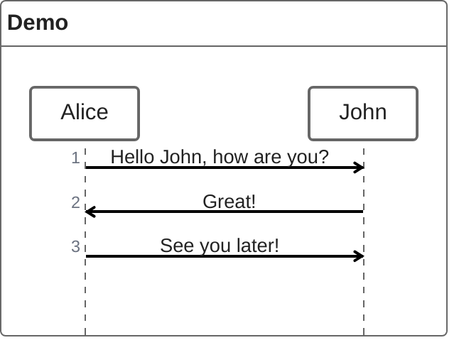

## 表格

| 左对齐   | 居中对齐 |   右对齐 |
|:------|:----:|------:|
| 内容1   | 内容2  |   内容3 |
| 长文本测试 | 居中展示 | 12345 |

## 三方插件

### plantuml

* 官方地址：[plantuml](https://plantuml.com/zh/)
* 示例

### mermaid

* 官网地址：[mermaid](https://mermaid.ai/open-source/syntax/mindmap.html)
* 示例

